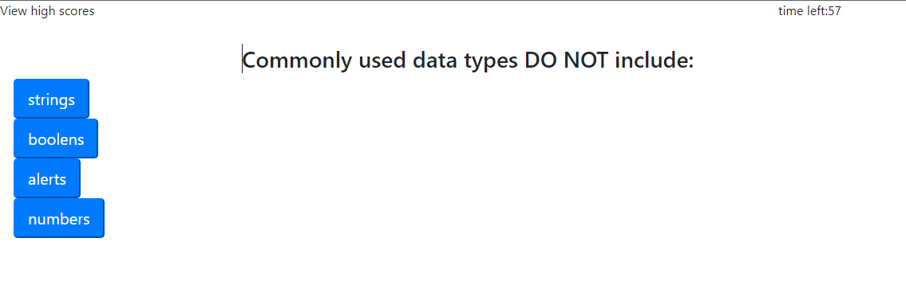

# JavaScript POP QUIZ

# User Story
  AS A coding boot camp student
  I WANT to take a timed quiz on JavaScript fundamentals that stores high scores
  SO THAT I can gauge my progress compared to my peers

# Acceptance Criteria
  GIVEN I am taking a code quiz
  
  WHEN I click the start button
  THEN a timer starts and I am presented with a question

  WHEN I answer a question
  THEN I am presented with another question

  WHEN I answer a question incorrectly
  THEN time is subtracted from the clock

  WHEN all questions are answered or the timer reaches 0
  THEN the game is over

  When the game is over
  THEN I can save my initials and score

 start screen before quiz

 quiz in action

# Website link:
* https://alu1868.github.io/challenge-4-popquiz/

# github link:
* https://github.com/alu1868/challenge-4-popquiz

# Author:
* https://github.com/alu1868

# Credits
* HTML
* CSS
* JavaScript
* BootStrap (https://getbootstrap.com/)